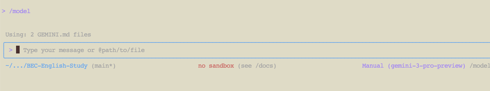
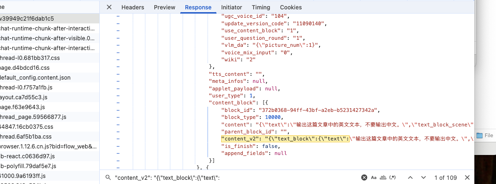
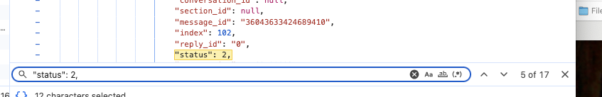
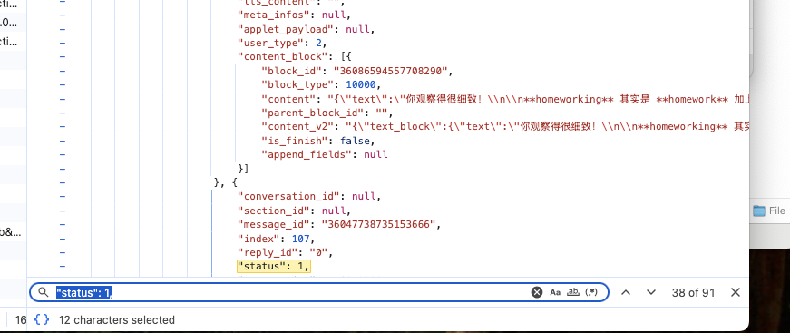
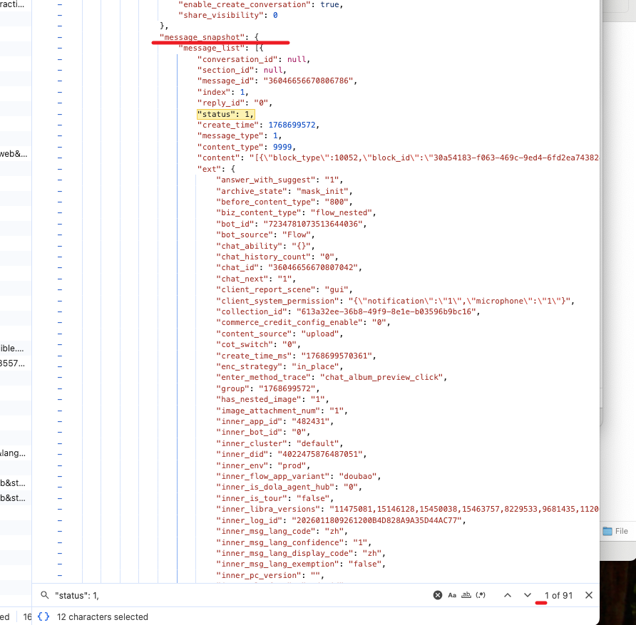

方法：
1.电脑端点分享后，ctrl+A复制全文
2.将全文内容用gemini加工，prompt:

我下面将发一段学生与老师的对话，你需要做的是：
1.准确区分学生和老师的发言
2.区分后分别标注【学生说】和【老师说】，不改动原文任何文字、格式
3.在每段学生发言和老师发言的末尾，各添加三行空行

3.核对
1）方式一
【老师说】+【学生说】的行数 大概等于

【"content_v2": "{\"text_block\":{\"text\":】的数量 减去 【"status": 2,】的数量

2）方式二
应该就是【"status": 1,】的数量

【"status": 1,】的第一个不算，所以是90个，刚好等于【老师说】+【学生说】的行数
