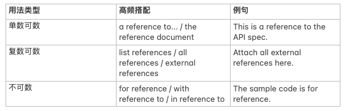
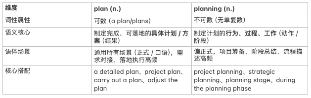

10个疑问点

【学生说】User authentication shall be performed via Google OAuth2. 这句话中的 shall 要怎么理解？

【老师说】这句话里的shall是正式书面语的强制类情态动词，核心表 **“必须、应当”，是技术文档 / 规范 / 协议中规定义务、要求、强制执行 ** 的标准用法，比 must 更贴合正式文书的语体，无 “将要” 的含义。 关键解析（适配技术文档场景）

	使用语境：仅用于正式书面文件（如技术规范、系统要求、合同、协议、接口文档），口语 / 日常邮件中几乎不用，职场里也仅出现在这类制式文本中。
	语义强度：和must同义（均为强制），但 shall 更符合英文技术文档的惯用语体，是行业通用的规范表达，这句话可直译为：用户认证必须通过 Google OAuth2 协议执行。
	主语搭配：此处主语是User authentication（物 / 事项），是 shall 的典型用法 —— 规定某件事 “必须按要求做”，而非针对人的命令。
易混区分（避免和其他含义混淆） ❌ 不是表将来（will 的含义）：技术文档中表将来不会用 shall，会直接用 will/shall be done（被动），而此处是主动表强制要求。❌ 不是表征求意见（如 Shall we...）：这种用法仅用于口语疑问句，书面正式文本中无此含义。 技术文档中同类替换（语体匹配）

	同义替换（强制，可互换）：must / shall（优先 shall，更规范）
	近义替换（要求，强度稍弱）：should（表 “建议应当”，非强制，技术文档中若用 should 则表推荐方案，而非硬性要求）
同类技术文档例句（贴合你的工作场景）

	All API requests shall be encrypted via HTTPS.（所有 API 请求必须通过 HTTPS 加密。）
	Access to the system shall be restricted by role-based permissions.（系统访问必须通过基于角色的权限进行限制。）
简单说：在你这句技术相关的正式表述中，shall = 必须（强制执行的技术要求），是这类文档的固定惯用表达。 需要我整理一份技术文档中高频情态动词（shall/must/should/may）的用法对照表，明确强制 / 建议 / 允许的语义和场景吗？

【学生说】Reference 用作单数还是复数？还是不可数名词？

【老师说】reference是可数名词，有明确单复数形式，也可作不可数名词（表抽象概念），职场 / 技术文档中可数用法更高频，分场景清晰区分，无混淆点：

可数名词（最常用，表「具体的参考资料 / 引用 / 提及」）

单数：a reference / the reference
复数：references（直接加 s，发音 /ˈrefrənsɪz/）
✅ 职场 / 技术文档高频例句： Check the reference in Section 3.（查看第 3 节的这份参考资料） All references shall be listed in the appendix.（所有参考资料需列在附录中） The document includes a reference to Google OAuth2.（文档中提及了 Google OAuth2） 2. 不可数名词（表抽象的「参考 / 借鉴 / 查阅」概念，无具体指向） ✅ 固定搭配 + 例句（多为短语）：

	for reference（供参考）→ This file is for reference only.（此文件仅作参考）
	with reference to（关于，职场邮件高频）→ With reference to your email...（关于你的邮件…）
	in reference to（提及 / 关于）
核心高频搭配（单复数 / 不可数精准用） 用法类型 高频搭配 例句 单数可数 a reference to... / the reference document This is a reference to the API spec. 复数可数 list references / all references / external references Attach all external references here. 不可数 for reference / with reference to / in reference to The sample code is for reference.

职场避坑：易混短语（固定用不可数） ❌ 不要说 for a reference /for references✅ 正确：for reference（固定搭配，不可数，表 “供参考” 的抽象含义） 一句话速记 表具体的资料 / 引用 / 提及→可数（a reference/references）；表抽象的参考概念 / 固定搭配→不可数（for reference/with reference to），技术文档 / 工作沟通中优先按可数用，几乎不会出错。

【学生说】Room for maneuver 和 room to maneuver 这两个都正确吗？如果都正确的话，它们的差异是什么？然后是什么意思？

【老师说】结论先讲 两个表达都完全正确，且核心含义一致，均为职场 / 商务 / 正式场景高频搭配，意思是 **“操作空间、变通余地、回旋余地”（指做事 / 决策时可灵活调整的范围）；二者仅在结构搭配、语体使用场景 ** 上有细微差异，无语义强弱区别。 核心含义 统一翻译：操作空间；回旋余地；变通余地✅ 高频使用场景：商务谈判、项目决策、技术方案调整、工作沟通等，表 “有 / 无灵活处理的空间”。✅ 基础例句：We have no room for/to maneuver on the budget.（我们在预算上没有任何变通余地。） 二者的核心差异（结构 + 场景）

Room for maneuver

结构：room + 介词 for + 名词（maneuver 此处为不可数名词）
语体 / 场景：更正式、书面化，是传统惯用搭配，适配正式文档、商务报告、合同、技术规范、正式会议发言等场景，也是英式英语中更偏爱的表达。
正式例句：The contract leaves little room for maneuver on delivery time.（这份合同在交货期上几乎没有回旋余地。）
Room to maneuver

结构：room + 不定式 to + 动词（maneuver 此处为动词）
语体 / 场景：偏中性、口语化，适配日常工作沟通、非正式会议、邮件往来等场景，美式英语中使用更频繁，比 for 版更简洁自然。
日常例句：Can we keep some room to maneuver on the project timeline?（我们能在项目时间线上留些操作空间吗？）
关键补充（避坑 + 拓展）

	maneuver 的拼写：美式拼作maneuver，英式拼作manoeuvre，因此搭配也可写为room for manoeuvre/room to manoeuvre（英式正式写法），含义不变。
	room 的属性：此处 room 为不可数名词，表 “空间、余地”，不能加 s，也不能用 a/an 修饰（❌ a room for maneuver；✅ some room for maneuver）。
	同义替换：日常 / 职场可替换为leeway（更口语）、flexibility（更书面），例：We have no leeway on the budget. = We have no room for maneuver on the budget.
	常用搭配：
	表 “有 / 无空间”：have (no/little/some/plenty of) room for/to maneuver
	表 “留空间”：leave/keep/make room for/to maneuver
一句话速记（适配你的工作场景） ✅ 正式文书 / 英式英语 → room for maneuver（for + 名词，更规范）✅ 日常工作 / 美式英语 → room to maneuver（to + 动词，更自然）二者语义完全一致，可根据沟通的正式程度替换使用。 职场高频实用例句（分场景）

	正式报告：The new policy provides sufficient room for maneuver for enterprise development.（新政策为企业发展提供了充足的操作空间。）
	工作邮件：I wonder if we can keep a little room to maneuver on the payment terms.（想请教下我们能否在付款条款上留一点变通余地。）
	项目沟通：We have almost no room for/to maneuver on the launch date.（我们在上线日期上几乎没有任何回旋余地。）
【学生说】They have a need for this 和 They have needs for this. 两句话都对吗？对的话有什么区别？

【老师说】结论先讲 两句话语法上都正确，但使用场景和语义侧重不同，职场 / 正式沟通中They have a need for this. 更常用、更自然，第二句仅特定语境下使用。核心含义均为：他们对此有需求。 关键差异（核心在need的单复数属性 + 语义指向）

✅ They have a need for this.（单数形式）

need此处为可数名词单数，表 **「一项整体、统一的需求」，指向某个具体事物 / 事项的单一需求 **，无细分维度。
使用场景：通用所有场景（正式 / 口语、职场 / 日常），是最自然的表达，适配绝大多数沟通场景（如需求对接、工作汇报、邮件沟通）。
例句：The development team has a need for this API tool.（开发团队对此款 API 工具存在一项需求。）
✅ They have needs for this.（复数形式）

need此处为可数名词复数，表 **「多项细分、具体的需求」，指向针对同一事物 / 事项的多个不同维度的需求 **（而非对多个事物的需求）。
使用场景：仅限需要强调「需求的多样性、细分性」时使用，日常 / 普通职场沟通中极少用，多出现于需求分析、方案设计等精细化沟通场景。
例句：Different departments have needs for this new system (e.g., data analysis, permission management).（不同部门对这套新系统有多项需求（如数据分析、权限管理）。）
3 个核心补充（避坑 + 实用，适配你的工作场景） ① 最简洁的同义替换（职场高频） 日常 / 邮件沟通中，比上述两句更自然的表达是：They need this.（用 need 作动词，简洁直接，无单复数困扰），正式度适中，优先推荐。 ② need 的词性区分（避免混用）

	作名词：have a need/needs for sth.（对…… 有需求）
	作动词：need sth. /need to do sth.（需要某物 / 需要做某事）→ 动词形式更简洁，职场中使用频率远高于名词形式。
③ 不可数用法（拓展，表抽象需求） need 也可作不可数名词，表抽象的「需求」概念，搭配为：There is a need for sth.（存在对…… 的需求），正式书面语高频（如报告、方案）。例：There is a need for stricter user authentication rules.（需要更严格的用户认证规则。） 用法速记（按「自然度 / 使用频率」排序，职场优先选）

	最简洁（通用）→ They need this.（need 作动词，无任何单复数问题）
	最常用（名词形式）→ They have a need for this.（表单一整体需求）
	特定场景（名词形式）→ They have needs for this.（仅强调多项细分需求时用）
职场场景例句对比（更易理解）

	普通需求对接：Our clients have a need for this new feature.（客户对这个新功能有需求。）
	精细化需求分析：Our clients have needs for this new feature (e.g., custom display, fast access).（客户对这个新功能有多项需求（如数据分析、权限管理）。）
	极简沟通：Our clients need this new feature.（客户需要这个新功能。）
我可以帮你整理职场中「需求表达」的高频句式清单（含动词 / 名词形式、正式 / 口语版），直接套用在邮件 / 需求沟通中，需要吗？

【学生说】Planning 和 plan 的区别。

【老师说】核心区别：词性 + 使用场景是核心，plan 可作名词 / 动词，planning 仅作名词（表抽象的 “规划 / 筹划过程”），二者作名词时，侧重和语体也不同，职场 / 日常高频混用，分场景讲清就不会错。 一、先明确基础词性 & 核心含义

	plan
	名词 (n.)：具体的计划、方案（可数，有单复数 a plan/plans），表 “已经成型的、可落地的具体安排”；
	动词 (v.)：计划、筹划（原形，变位 plan/plans/planned/planning），表 “做计划的动作”。
	planning
	仅作名词 (n.)：抽象的规划、筹划过程（不可数），表 “制定计划的这个行为 / 阶段，而非计划本身”；
	也可作动词现在分词（跟在 be 动词后，表 “正在计划”），属 plan 的动词变形。
二、最易混：二者作名词的核心差异（职场高频） 

三、planning 作现在分词的用法（动词变形，无歧义） 紧跟 be 动词，表正在进行的 “计划” 动作，此时是 plan 的动词时态变化，和名词 planning 无关：

	We are planning the user authentication process.（我们正在规划用户认证流程。）
	They were planning to adjust the budget.（他们当时正计划调整预算。）
四、职场高频搭配 & 例句（分词性，直接套用）

plan 作名词（最常用）

高频搭配：a project plan /make a plan /carry out a plan /adjust the plan /detailed plans
例句：Please send the detailed plan for the OAuth2 integration.（请发送 OAuth2 集成的详细方案。）
plan 作动词（简洁，职场优先用）

高频搭配：plan to do sth. /plan sth. /plan for sth.
例句：We plan to finish the development by Friday.（我们计划周五前完成开发。）
planning 作名词（表规划过程）

高频搭配：project planning /strategic planning /planning stage /during the planning phase
例句：Planning is the most important part of the project.（规划是这个项目最重要的环节。）
五、一句话速记（避坑 + 高效使用）

	想表达具体的方案 / 安排→ 用plan（名 / 动均可，可数，有单复数）；
	想表达制定计划的过程 / 工作→ 用planning（不可数名词）；
	想表达正在做计划的动作→ 用be planning（现在分词，plan 的动词变形）。
六、职场避坑：易混表达纠正 ❌ We are making a planning for this.✅ We are making a plan for this.（plan 是具体方案，可数）✅ We are doing the planning for this.（planning 是规划工作，不可数） ❌ The planning is ready. ✅ The plan is ready.（“方案准备好了” 是具体结果，用 plan）

【学生说】Planning 作名词和 plan 作名词的区别。

【老师说】核心区别（仅作名词时） plan 是可数名词，表具体、成型的计划 / 方案（结果）；planning 是不可数名词，表抽象的规划 / 筹划行为 / 过程（动作）。二者语体、搭配、使用场景也有明确区分，职场中核心看想表达「落地的方案」还是「制定方案的过程」。 
详细对比（职场高频场景适配）  

职场高频例句（直观区分） plan (n.) 表具体方案

	Please provide the plan for the system upgrade.（请提供系统升级的具体方案。）
	We have two plans for the OAuth2 integration, choose one.（我们有两个 OAuth2 集成方案，选其一。）
	The plan has been approved by the manager.（这份方案已被经理批准。）
planning (n.) 表规划过程 / 工作

	Planning for the new project will start next Monday.（新项目的规划工作下周一启动。）
	We are in the planning stage of user authentication reform.（我们处于用户认证改造的规划阶段。）
	Strategic planning is essential for long-term project development.（战略规划对项目长期发展至关重要。）
关键避坑（职场易混错误） ❌ The planning is ready.（想表达 “方案就绪”，错用过程代结果）✅ The plan is ready. ❌ We need to make a planning for this task.（planning 不可数，不能用 a 修饰）✅ We need to make a plan for this task.✅ We need to do the planning for this task. 一句话速记 提具体的、能落地、可修改 / 批准的方案 → 用plan（可数）；提制定方案的工作、阶段、行为本身 → 用planning（不可数）。 需要我整理一份职场中 plan/planning 的高频固定搭配清单，直接套用在邮件、项目文档中吗？

【学生说】With all that being said 和 with that context being said 这两个有什么区别吗？分别什么意思？

【老师说】核心结论 两句话语法均正确，均为英文口语 / 书面语中承接上文的过渡表达，但语义侧重、使用场景、搭配自然度差异显著，With all that being said 是通用惯用表达，with that context being said 是非惯用搭配（偏中式表达），日常 / 职场优先用前者。 一、With all that being said 核心含义 综上所述；尽管如此；说了这么多（承接前文提到的所有信息、观点、情况，引出后续的总结、结论、转折或补充观点） 关键特点

	惯用表达：英文本土高频通用搭配，口语（会议、沟通）和书面语（邮件、报告）均适用，自然无违和；
	指代范围：指代前文全部相关内容（可多可少，无明确限制），是最灵活的承接过渡句；
	语气：中性，可表顺承总结，也可表轻微转折（前文讲背景 / 原因，后文讲结果 / 决策）。
职场高频例句

	With all that being said, we decide to adopt Google OAuth2 for user authentication.
综上所述，我们决定采用 Google OAuth2 做用户认证。 All the budget constraints have been listed. With all that being said, we still need to finish the project on time. 所有预算限制都已列明，尽管如此，我们仍需按时完成项目。 二、with that context being said 核心含义 结合上述背景来看；就上述语境而言（承接前文提到的特定背景、语境信息，引出基于该背景的判断 / 结论） 关键特点

	非惯用搭配：英文中无此固定表达，是中式思维的直译，本土使用者极少使用，职场正式沟通中易显生硬；
	指代范围：仅能指代前文的背景 / 语境类信息（如项目背景、业务场景、沟通语境），指代范围极窄，无法指代观点、事实、情况等；
	替换建议：想表达此含义，英文有更自然的惯用表达，无需用这个搭配。
可用但生硬的例句

	We have explained the market demand and technical constraints. With that context being said, this plan is the most feasible.
我们已说明市场需求和技术限制，结合上述背景，这个方案是最可行的。 三、核心差异对比表 表达 惯用性 指代范围 使用场景 语气 自然度 With all that being said 英文通用惯用 前文所有相关内容（信息 / 观点 / 情况 / 背景） 口语 + 书面语，全场景 中性（总结 / 转折） ⭐⭐⭐⭐⭐ with that context being said 非惯用（中式直译） 仅前文背景 / 语境类信息 仅限背景承接场景，极少用 纯顺承（基于背景下的结论） ⭐⭐ 四、实用替换（重点！替代生硬表达） 如果想表达 **“结合上述背景 / 语境”的含义，直接用以下英文本土惯用表达 **，比 with that context being said 自然得多，职场优先用：

	In that context（最贴合，通用）
例：In that context, this solution is more suitable for our project. Given that context（偏正式，书面语 / 会议） 例：Given that context, we need to adjust the project timeline. With that in mind（偏口语，日常工作沟通） 例：We know the team's capacity now. With that in mind, we can set a realistic goal. 五、职场使用建议

	优先用：With all that being said → 全场景通用，无使用限制，承接上文最自然；
	想表背景承接：用In that context/Given that context → 替代生硬的 with that context being said；
	避免用：with that context being said → 非本土表达，正式沟通中易影响表达专业性。
补充：极简同义表达 如果想更简洁，口语中可直接说That being said（= With all that being said），含义、用法完全一致，更简洁自然：

	That being said, we have no room...
【学生说】With all that being said 和 All that being said 有什么区别？

【老师说】核心结论 All that being said 和 With all that being said 语义、用法、场景完全一致，都表示综上所述 / 尽管如此 / 说了这么多，是承接上文的通用过渡表达；唯一区别是多了一个 with，语体上有极细微的正式度差异，日常 / 职场中可完全互换，无理解偏差。 具体差异（仅语体 & 使用习惯，无语义区别）

All that being said

语体：更简洁，偏中性 / 口语化一点，美式英语中使用频率更高；
特点：直接作句首过渡语，省略介词 with，读起来更流畅，是日常沟通、会议发言、非正式邮件的优选；
例句：All that being said, we’ll stick to the original plan for OAuth2 integration.
With all that being said

语体：比前者稍正式，书面感略强，英式英语中更常见；
特点：带介词 with，句式结构更完整，适配正式邮件、项目报告、书面文档等场景，也可用于口语，无违和；
例句：With all that being said, the team shall finish the user authentication development by Friday.
关键补充（3 个实用点）

	完全可互换：二者在任何场景下替换，都不会改变句意、也无语法错误，职场 / 日常不用纠结，按自己的表达习惯选即可；
	极简版延伸：口语中还会用更短的That being said，和前两者语义、用法也完全一致，最简洁，沟通中使用频率最高；
例：That being said, we have no room to maneuver on the budget. 使用位置：均只能放句首，后接逗号，引出后续的总结、结论或转折，不能放句中 / 句尾。 一句话速记 All that being said = With all that being said = That being said，仅句式简洁度 / 正式度有极细微差别，全场景通用、可随意互换。 需要我整理几个职场高频的承接上文过渡表达（含不同正式度，适配邮件 / 会议 / 报告）吗？

【学生说】Provide somebody something, provide something to somebody, provide something for somebody. 这三个有什么区别？

【老师说】核心结论 provide something to/for somebody 是规范正确用法，全球通用；provide somebody something 是非正式口语用法（偏美式），正式 / 书面 / 职场场景禁用；to/for 版语义完全一致，仅搭配习惯有细微地域差异，可互换。 一、分用法详解（按「正式度 / 正确性」排序）

✅ provide something for somebody

规范度：最通用的规范用法，英式 + 美式英语均高频使用，正式 / 口语 / 职场全场景适配（优先推荐）；
核心搭配：provide + 物（sth.） + for + 人（sb.）；
职场例句：We will provide a detailed plan for the client next Monday.
✅ provide something to somebody

规范度：同样为规范用法，美式英语更偏爱，英式也通用，正式 / 口语均可；
核心搭配：provide + 物（sth.） + to + 人（sb.）；
职场例句：The IT team will provide technical support to all departments.
⚠️ provide somebody something

规范度：非正式美式口语用法，属于「双宾语省略介词」的口语表达，语法上非严格规范；
使用场景：仅用于日常面对面闲聊，职场正式沟通（邮件 / 报告 / 会议）、书面文档一律禁用，会显表达不专业；
例句（仅口语）：Can you provide me a pen?（正式需改为：Can you provide a pen for/to me?）
二、provide sth. for sb. vs provide sth. to sb. 核心差异 二者语义完全一致（均为「为某人提供某物」），无语气 / 强度区别，仅使用习惯 + 细微场景偏好不同：

	地域偏好：for 版是英 / 美通用的「基础规范款」；to 版在美式商务 / 日常中使用比例更高；
	场景微偏好：表「为某人专门准备 / 定制的某物」，for 版语感更贴合（如 provide a solution for the project）；表「将某物交付 / 给到某人」，to 版更贴合（如 provide the document to the manager），但此差异极弱，实际可完全互换。
三、职场核心避坑（3 个关键规则）

	正式场景绝对禁用：provide sb. sth.（如❌ provide the client a plan → ✅ provide a plan for the client）；
	不可混搭：不能说 provide for sb. sth. 或 provide to sb. sth.，必须「物在前，人在后」；
	被动语态搭配：规范结构为sth. be provided for/to sb.（同样禁用 sb. be provided sth.），例：The API document is provided for all developers.
四、高频职场例句（规范用法，直接套用）

	The company will provide training for all new employees on Google OAuth2.
	We need to provide the updated requirements to the development team as soon as possible.
	This system can provide real-time data for the marketing department.
	The support team is responsible for providing technical assistance to our users.
一句话速记 ✅ 正式 / 职场通用：provide sth. for sb.（首选）/ provide sth. to sb.（美语偏爱）⚠️ 仅非正式口语：provide sb. sth.三者语义一致，核心区别在规范度和使用场景。 需要我整理一份职场高频 “提供类” 动词搭配表（include/offer/supply/provide 区分，避免混用）吗？

【学生说】Give somebody something, give something to somebody 都可以吧？

【老师说】两者都完全正确，且全场景通用（正式 / 口语 / 职场均可），语义完全一致，核心都是「把某物给某人」，仅句式结构不同，是 give 的两种经典双宾语用法，和 provide 的非正式省略版不同，give 的这两种搭配无任何规范 / 场景限制。 简单区分（仅结构 / 使用习惯，无对错）

	give sb. sth.（双宾语直接连用）
更简洁，口语 / 日常沟通中使用频率更高，读起来更流畅。 例句：Give me the plan. / The system gives users real-time data. give sth. to sb.（加介词 to 衔接） 结构更完整，若sth. 是较长的名词短语（带定语 / 修饰），用这个句式会让句子更通顺，正式书面中也更常用。 例句：Give the detailed project plan to the client. / We gave the updated OAuth2 document to all developers. 关键补充（2 个实用点，适配职场）

	sth. 较长时，优先用 give sth. to sb.
避免头重脚轻，比如不说「Give the team a detailed plan for the system upgrade」，更顺的表达是「Give a detailed plan for the system upgrade to the team」。 被动语态只能用 be given to sb. 无「sb. be given sth.」的错误形式，直接用规范结构： 例句：The plan was given to the manager for approval.（这份方案已提交给经理审批。） 职场高频例句（两种都可，按需选）

	Give me your feedback by EOD. = Give your feedback to me by EOD.（下班前把反馈发给我。）
	The IT department will give all staff a new access token. = The IT department will give a new access token to all staff.（IT 部门会给所有员工发放新的访问令牌。）
简单说，give sb. sth. 和 give sth. to sb. 可随意互换，唯一要注意的是「长名词短语作 sth. 时，用 to 版更通顺」，其余场景按自己的表达习惯选就好。
