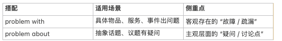
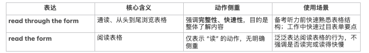

【学生说】 提取图片中的课文内容

【老师说】 以下是提取的课文内容：

	Listening Script 3.6 Exam Spotlight Part 1
	Questions 1 to 12 You will hear three telephone conversations or messages.
	Write one or two words or a number in the numbered spaces on the notes or forms below.
	You will hear each recording twice.
	Conversation 1 Questions 1 to 4 Look at the form below.
	You will hear a woman telephoning about a problem with her subscription to a business magazine.
	You have 15 seconds to read through the form.
	Now listen and fill in the spaces.
	Thank you for calling Business Monthly.
	Please state your name, the name of your company or organisation, and your address.
	If you already have a subscription with us, please give your subscription number and the reason for your call.
	Hello.
	This is Cynthia Perkins.
	That's P-E-R-K-I-N-S.
	I'm the Research Manager at Rave Solutions, that's R-A-V-E Solutions.
	You've got our address on record.
	I'm calling about our current subscription.
	The number is I-L-O-3-7-8-J-U-L.
	We paid for 12 issues but we've only received 11.
	Please send the June edition of the magazine.
	Thank you very much.
	Now listen to the recording again.
	Hello.
	This is Cynthia Perkins.
	That's P-E-R-K-I-N-S.
	I'm the Research Manager at Rave Solutions, that's R-A-V-E Solutions.
	You've got our address on record.
	I'm calling about our current subscription.
	The number is I-L-O-3-7-8-J-U-L.
	We paid for 12 issues but we've only received 11.
	Please send the June edition of the magazine.
	Thank you very much.
【学生说】 这篇课文的 Exam Spotlight 是什么意思？

【老师说】 在这篇课文中，Exam Spotlight 意为“考试重点”，是商务英语考试（如BEC）备考材料中的一个板块。 它的作用是聚焦考试中的关键题型和考点，像这篇课文里就针对听力考试的“电话对话/留言填空”题型进行专项训练，帮助学习者熟悉考试形式、掌握答题技巧，从而提升应对这类考试的能力。

【学生说】 那针对 spotlight 在这里的用法，我可以说 test spotlight 或者是 lecture spotlight 吗？

【老师说】 在英语表达中，“Spotlight” 有“聚焦、关注”的含义，因此可以根据具体语境类比使用 “Test Spotlight”（考试聚焦/测试重点） 或 “Lecture Spotlight”（讲座聚焦/授课重点），用来表示针对考试、讲座中关键内容的专项板块或关注重点，这种用法是符合英语表达逻辑的。 比如：

	“This book has a Test Spotlight section that analyzes common exam questions.”（这本书有一个“考试聚焦”板块，分析常见的考题。）
	“The course includes a Lecture Spotlight to help students review core concepts.”（这门课包含一个“讲座聚焦”环节，帮助学生复习核心概念。）
【学生说】 You will hear a woman telephoning about a problem with her subscription to a business magazine.这句话中，problem后面的with是什么意思？

【老师说】 在这句话中，“problem with...” 是一个常用的搭配，其中 “with” 表示 “关于…… 的；与…… 有关的”，用来引出问题所涉及的具体对象。 具体来说，“a problem with her subscription to a business magazine” 意思是 “她订阅商业杂志这件事上出现的问题”，“with” 在这里明确了问题是和 “订阅杂志” 这一事项相关的。

【学生说】 那可以改写成 a problem about her subscription to a business magazine 吗？

【老师说】 在英语表达中，“a problem with sth.” 是更常用、更自然的搭配，用来表示 “某事物存在的问题”；而 “a problem about sth.” 虽然语法上不算错误，但使用频率较低，且语义上更偏向 “关于某事物的问题（侧重讨论、思考层面的问题）”，而非 “某事物本身存在的故障、疏漏类问题”。 在这个句子中，是指订阅杂志这件事本身出现了问题（如未收到期刊），所以用 “with” 更准确、自然，不建议改写成 “about”。

【学生说】 请帮我讲解一下 problem with 和 problem about 区别。

【老师说】

核心语义差异

problem with + 事物：强调事物本身存在的故障、缺陷或麻烦，是事物客观上出现的问题。
例：There is a problem with the printer.（打印机出故障了。） problem about + 话题：强调关于某个话题的疑问、困惑或讨论性问题，是主观层面的疑问或议题。 例：We need to discuss a problem about the new project budget.（我们需要讨论关于新项目预算的一个问题。） 
2. 使用场景区分

3. 结合你课文例句的验证课文里 “a problem with her subscription”，指的是订阅服务本身的疏漏（付了 12 期只收到 11 期），属于事物客观出问题，用 with 是唯一地道的选择；若换成 about，语义会变成 “关于订阅的一个讨论性问题”，和原文语境完全不符。 你是否需要用这两个搭配分别造一个职场场景的句子，来巩固用法？

【学生说】 这篇文章中有一句叫做 Read through the form， 为什么要用 through 而不能直接用 Read the form？

【老师说】 read through 是一个短语动词，强调从头到尾完整地通读的动作，带有快速浏览、整体了解内容的含义；而 read the form 仅表示 “阅读表格” 这个动作，不明确阅读的完整性或速度。 在这篇听力题的语境里，“You have 15 seconds to read through the form” 是要求考生在 15 秒内快速通读表格，提前熟悉填空的位置和相关信息，为听录音做准备；如果换成 read the form，就无法体现 “快速通读、整体预览” 的考试要求。 我可以帮你整理几个商务场景中类似的短语动词（如 look through、go through） 的用法对比，方便你在工作和考试中区分，需要吗？

【学生说】 整理一下 read through the form 和 read the form 的区别。

【老师说】 

例句对比

	听力考试场景：You have 15 seconds to read through the form before listening.
	日常工作场景：Please read the form carefully and sign it if you agree.
我可以帮你整理一份商务英语中含 through 的高频短语动词清单，方便你积累职场常用表达，需要吗？

【学生说】 这篇课文提到这样一句话 Please state your name. 这句话可以改写成Please tell me your name吗？

【老师说】 可以改写，但二者在正式程度、使用场景上有明显区别：

	Please state your name 更正式、书面化，语气偏严谨，常用于客服电话、表单填写、正式问询等场景（和课文里的商务杂志订阅电话语境完全匹配）。
	Please tell me your name 更口语化、日常化，语气更随意，适合非正式的面对面沟通或熟人之间的询问。
在你课文的商务电话场景中，用 state 比 tell me 更符合职场正式表达的要求。 我可以帮你整理一份商务电话常用正式动词 vs 日常动词的对照表，方便你在工作沟通中精准选用，需要吗？

【学生说】 这篇文章提到这样一句话If you already have a subscription with us 这句话中subscription with中的with是什么意思？以及什么作用？

【老师说】 这里的 with 是介词，含义为 **“与……（方）相关”，作用是明确 subscription（订阅服务）的合作对象 **，即 “与我们公司之间的订阅关系”。 具体来说，“a subscription with us” 强调订阅服务是用户和我方机构之间建立的合作关系，with 在这里清晰点明了合作的另一方主体。这种搭配在商务场景中很常用，比如 a contract with the client（和客户的合同）、a partnership with the supplier（和供应商的合作关系）。 你是否需要我结合软件开发职场场景，用 subscription with 这个搭配造几个可以直接用在工作沟通里的句子？

【学生说】 那这句话可以改写成 If you already have our subscription 吗？

【老师说】 可以改写，且语义基本通顺，但二者在侧重点和表达严谨性上有区别：

	If you already have a subscription with us：用 with us 明确强调 “订阅关系是建立在用户与我方机构之间”，语气正式、严谨，符合商务客服场景的规范表达。
	If you already have our subscription：用形容词性物主代词 our 直接修饰 subscription，侧重 “订阅的是我方提供的服务”，语气更简洁，但少了对 “双方合作关系” 的明确指向。
在课文的客服电话语境中，原句的表达会更地道、更贴合商务沟通的正式感；改写后的句子日常使用也没问题，只是正式程度稍弱。 我可以帮你整理几个商务场景中 “with + 合作方” 的高频搭配，方便你在工作中快速套用，需要吗？

【学生说】 需要

【老师说】 商务场景中 “with + 合作方” 高频搭配

	a contract with + 合作方
例：We’re negotiating a contract with a new software vendor. a partnership with + 合作方 例：Our company has established a long-term partnership with a cloud service provider. an agreement with + 合作方 例：We finally reached an agreement with the overseas client on the project timeline. a deal with + 合作方 例：The team closed a big deal with a fintech firm last quarter. correspondence with + 合作方 例：Please check the correspondence with the technical support team for details. a dispute with + 合作方 例：We’re trying to resolve a minor dispute with our logistics partner. 这些搭配都能明确体现双方的业务关联，和你课文里的 a subscription with us 属于同一类正式商务表达逻辑。 我可以帮你把这些搭配放进软件开发职场的情景对话里，让你直接套用在工作沟通中，需要吗？

【学生说】 You've got our address on record.课文中的这句话的on record是什么意思

【老师说】 在这句话中，on record 是一个固定短语，意思是 “有记录在案的；存档的”。 它的作用是说明 “地址” 这个信息已经被对方（商务杂志方）留存、记录在系统或文件里了，不需要再重复提供。例：All customer contact details are kept on record for future reference.（所有客户联系方式均存档备查。） 我可以帮你整理几个职场电话沟通中类似的实用短语，方便你在站会或客户对接时使用，需要吗？