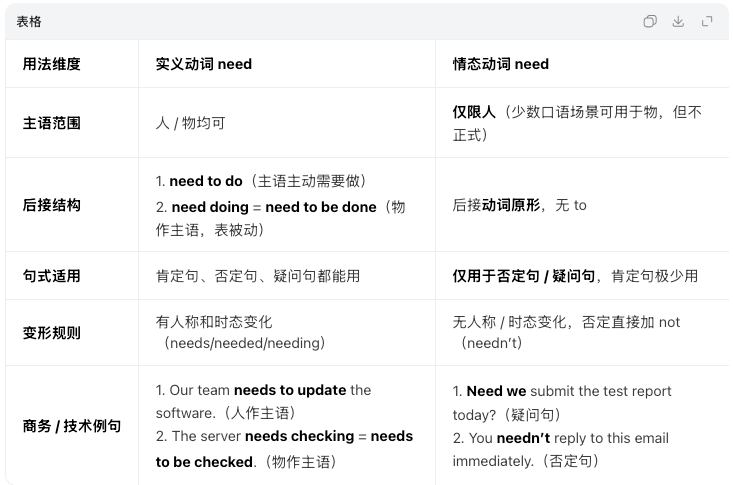

【学生说】 提取图片中的课文文本。

英文原文 Module 4, Listening Script 4.1 Advertising on the WebImagine you have a new product or a new service and you want the world to know about it.One way would be to write the advertisement onto ten or a hundred or a thousand pieces of paper and drop them from the sky over your town or city.Someone on the ground might pick one up and read it, maybe two or three people.On the other hand, the wind might blow them away.Now, imagine doing the same thing, but this time throwing them into the air with adverts for every other product or service in the world.You probably wouldn't do it, would you?Well, unfortunately, that's what it's like to advertise on the Internet.Trying to make your product, service or website known to the rest of the Internet community can be very, very frustrating.Not only making it known, but getting visitors to actually visit the site can seem impossible. But there are ways to overcome the impossible when advertising on the Internet.As long as you follow three rules.So, rule number one.The first thing is to remember that people use search engines.So whenever someone types in a keyword linked to your business, your site needs to appear in the top 50 or so listings in all of the major search engines.Any lower and no one will ever find you. My second rule is that it's a good idea to spend some useful time and effort on getting your links on other sites.This is an excellent, though very time-consuming way to increase visitors.You can do this by sharing links with other companies so they have a link on your site and you put one on theirs.Or perhaps through a site review which recommends your products.Also remember that the more links you have elsewhere, the more likely people are to find you through a search engine. My third tip is never to pay for advertising on the web.I think that unless you have a very good reason, it's a waste of money.With so many ways to get free advertising, I've found very little reason to pay for things like banners to promote my site. So, those are my three starting points for anyone thinking of web advertising.Before we finish, one final tip: a mailing list.Having a name that people can easily type will help.Email mailing lists can work and are an easy way to get traffic to the site, though it does take time.What's more, it's better to have an email newsletter which people sign up for.I've found this to be very effective and more positive than sending spam.Of course, there are costs with prizes or anything free, maybe some software or consultants.Once they've come once to the site, keep statistics on how many return to the site regularly.In other words, track them. They are now clients, they are where they come from and what they like doing on their free time. You can use this kind of information to ask them to subscribe to your newsletter, for example, by telling them that it's free.

这篇文章中提到了一句叫 write the advertisement onto。这句话中的 onto 是什么意思？不能直接用 on 吗？

【老师说】

onto 的核心含义 这里的 onto 是介词，强调 “到…… 表面之上” 的动态过程 ，突出 “把广告写上去” 这个动作的方向性和结果 —— 从无到有地将文字附着在纸张表面。

onto vs. on 的区别（结合本句语境）

onto：动态：强调 “移动 / 附着到某物表面” 的动作过程。完全适配，原文就是描述 “把广告在纸上” 的动作。

on：静态：强调 “处于某物表面” 的状态；若表动作则语气平淡，无 “附着上去” 的动态感。语法上不算错，但丢失了原文 “主动书写、使广告出现在纸上” 的动作意味。

商务 / 技术场景的延伸用法 在你接触的职场场景中，这种动态介词的区别也很常用： 例 1（技术文档）：Upload the file onto the server （把文件上传到服务器上 → 强调 “传输并存储到目标位置” 的动态过程） 例 2（商务沟通）：Put the contract onto the shared drive （把合同放到共享盘里 → 突出 “从本地转移到共享位置” 的动作）

我可以帮你整理一份英语动态介词（onto/into/onto 等）在商务技术场景的高频用法表，需要吗？

【学生说】 这篇文章中提到了一句叫 someone on the ground，这句话中的 on the ground 是什么意思？

【老师说】 在这个语境里，on the ground 是字面含义，指 “在地面上的”，用来修饰 someone，即 “地面上的人”。 它和你可能在商务、技术场景中遇到的引申义（表示 “实地的、一线的”）不同，比如：

商务场景：on-the-ground staff（一线工作人员）

技术场景：on-the-ground testing（实地测试） 这篇文章里只是单纯描述 “站在地面上捡到传单的人”，没有引申含义。 我可以帮你整理on the ground 不同场景的用法对比表，把字面义和引申义的例句都列出来，需要吗？

【学生说】 这句话中提到了一句叫做 adverts for every other product or service。这句话中 adverts 是什么意思？还有 for 的作用。

【老师说】

adverts 的含义 adverts 是 advertisements 的缩写形式，属于口语和非正式书面语中常用的简写，意思是 “广告”，和文章中前文的 advertisement 是同一个意思，在商务场景中也常被使用（比如商业报告、邮件里的简略表达）。

for 的作用 这里的 for 是介词，核心作用是表 “对象 / 用途”，说明这些广告是针对“其他所有产品或服务” 而制作的，即 “为…… 做的广告”。 语法结构：adverts for + 名词 是商务英语中描述广告对象的常用搭配，例：adverts for new software（新软件的广告）、adverts for financial services（金融服务的广告）。

【学生说】 注意这里的 for 表示的是限定对象，对吧？

【老师说】 你的理解方向是对的，但更精准的表述是：这里的 for 是表 “对象 / 用途”，而非单纯的 “限定”。 “限定” 更多是对事物范围的划定（如 the adverts of the company 中 of 表所属限定），而本句中 for 强调的是广告的服务对象、目的指向—— 这些广告是 “为了 / 针对” 其他产品或服务而存在的，是广告与对象之间的 “目的关联”，而非范围限定。 比如商务场景中：

a brochure for new tech products（针对新技术产品的宣传册）→ for 表宣传册的服务对象；

a meeting for project discussion（用于项目讨论的会议）→ for 表会议的用途。 我可以帮你整理英语中介词 for/of 表对象与限定的辨析表，结合商务场景例句让你更易区分，需要吗？

【学生说】 that's what it's like to advertise on the Internet.怎么理解其中的 that's what it's like.

【老师说】 句型拆解与含义 that's what it's like 是一个常用句型，核心意思是 “事情就是这个样子的”“情况就是如此”，用来对前文描述的场景或状态进行概括总结。

that：指代前文 “撒传单却被风吹走、被其他广告淹没” 的糟糕场景；

what it's like：表示 “（某件事）的样子 / 状况”；

整句直译：“在网上打广告就是这种感觉 / 情况”，结合语境可意译为 “这就是在互联网上做广告的真实写照”。 商务场景拓展例句 这个句型在日常职场沟通中很实用，比如：

That's what it's like to manage a cross - border project（管理跨境项目就是这种状况）

That's what it's like to negotiate with overseas clients（和海外客户谈判就是这个样子） 我可以帮你整理这个句型在商务和技术场景的 10 个高频例句，方便你直接套用，需要吗？

【学生说】 这篇课文中有提到这个表达 make something known 这句话是什么意思？

【老师说】 make something known 是一个常用短语，核心含义是 “使某事/某物被人知晓；宣传某事/某物”。 在课文语境中，make your product, service or website known 就是 “让你的产品、服务或网站被更多人知道”，也就是网络广告的核心目的——提升曝光度。 商务/技术场景拓展用法

被动形式 be made known 更正式，常用于邮件或报告：The new software update will be made known to all users next week.

后接介词 to 可明确受众：We need to make this policy known to the overseas technical team. 我可以帮你整理make+宾语+known的商务场景高频搭配，需要吗？

【学生说】 Make 的这种用法的总结。

【老师说】 make + 宾语 + known 的核心用法总结

基本结构与含义

结构：make + 宾语（事物/信息）+ known (+ to + 目标受众)

核心含义：使…… 被知晓；宣传……；公示……

本质：“动词 + 宾语 + 宾语补足语” 结构，known 是过去分词作宾补，表 “被动状态”（被他人知道）。

关键变体与场景搭配（表格省略）

同义替换（按正式程度排序）

口语 / 非正式：let people know sth.

通用：publicize sth. / promote sth.

正式 / 商务：announce sth. / disclose sth. / notify sb. of sth.

技术 / 职场高频注意点 ① 宾语通常是 抽象事物（policy, update, decision, requirement 等），少用于具体物品；② 后接 to 引出受众时，不能换成 for（make sth. known for sb. 是错误表达）；③ 被动形式 be made known 更适用于邮件、报告、通知等正式文本。

【学生说】 这篇课文当中提到了一句叫 overcome the impossible，这句话中的 the impossible 是什么意思？为什么可以这样用呢？

【老师说】

the impossible 的含义 这里的 the impossible 指 “看似不可能的事 / 难题”，在课文语境中就是 “让产品被知晓、吸引访客访问网站这件难事”。

用法原理：定冠词 the + 形容词 定冠词 the 后接形容词（如 impossible, possible, necessary, unknown），可以将抽象的形容词概念名词化，表示一类事物或情况，作句子的主语或宾语。 语法本质：the + 形容词 = 名词短语，指代具有该属性的人或事物。 商务 / 技术场景拓展例句： We need to solve the unknown in the system test.（解决系统测试中未知的问题） The team worked hard to achieve the impossible before the deadline.（在截止日期前完成了看似不可能的任务） 我可以帮你整理一份the + 形容词 表抽象概念的商务高频短语清单，需要吗？

【学生说】 所以这里的 the impossible 表示的不是一类东西，而是一件事，对吧？

【老师说】 你的判断完全正确。 这里的 the impossible 并不是指代一类事物，而是特指前文提到的 “让产品被知晓、吸引访客访问网站” 这件具体的难事，属于定冠词 the + 形容词 表单数特指的用法。 这种用法在商务场景中也常用来指代特定的难题或任务，比如：The team focused on tackling the urgent first（团队优先处理这件紧急的事），这里的 the urgent 也是特指当下的紧急任务。 我可以帮你整理the + 形容词 表特指单数事物的商务例句，方便你积累，需要吗？

【学生说】 the impossible 可以等于 impossible things 吗？

【老师说】 不完全等同，二者的核心区别在于指代范围和特指性。

the impossible：在课文语境中是特指前文提到的 “网络广告引流难” 这件事，是单数概念；脱离具体语境时，可泛指 “所有不可能的事”，但语气更抽象、正式。

impossible things：是泛指各种不可能的事情，是复数概念，没有明确的特指对象。 商务场景例句对比

The team pulled off the impossible (特指某个具体的艰巨任务).

We don’t waste time on impossible things (泛指各类办不到的事). 我可以帮你整理一份the + 形容词 与 形容词 + 名词 的指代差异对照表，需要吗？

【学生说】 由于连读 这两个单词没听出来 use search

【老师说】 use search 连读发音与听辨

音标：use /juːz/；search /sɜːtʃ/（英）/sɜːrtʃ/（美）

连读现象：use 尾音 /z/ + search 首音 /sɜː/ 连读成 /juːz sɜːtʃ/，听起来像 “you-zsearch”，中间无停顿

听辨关键：抓 /juː/ 开头和 /tʃ/ 结尾，中间 /z s/ 快速衔接，整体流畅无断音 发音与练习技巧

慢速拆分：先读 use /juːz/，再读 search /sɜːtʃ/，确保每个音清晰

自然连读：加快速度，让 /z/ 与 /sɜː/ 自然衔接，/z/ 轻触，不重读

高频场景：商务中常用 use search tools / use search engines，结合语境更容易听出 职场同类连读拓展

use case → /juːzkeɪs/（用例）

use data → /juːzdeɪtə/（使用数据）

use tools → /juːztuːlz/（使用工具） 需要我把这几个短语录成慢速→正常→快速的三步跟读脚本，你直接照着练吗？

【学生说】 这篇文章中提到了一个叫 types in a keyword linked to your business 这句话中的 linked 怎么理解？

【老师说】 这里的 linked 是 link 的过去分词，作后置定语，修饰前面的 a keyword，核心含义是“与……相关联的”。

语法结构：a keyword linked to your business = a keyword that is linked to your business，属于过去分词短语作定语的省略形式，表被动和关联关系。

整部分翻译：与你的业务相关的关键词。 商务/技术场景拓展用法

后置定语是职场文本的高频写法，简洁正式：We need to collect all the data linked to the project for the report.

可替换为 related to，语气更口语化；associated with 则更正式，适用于技术文档：The system can filter out the information associated with the user’s query.

【学生说】 这篇文章的内容里面有一句话叫 your site needs to appear in the top 50 or so listings . 这里的主语不是人，为什么谓语可以用need？

【老师说】 这是因为 need 既可以作实义动词，也可以在特定语境下作半情态动词，且它的主语可以是物。

语法本质：本句中 needs 是实义动词，实义动词 need 的主语可以是人或物，后接不定式 to do，表示 “某物需要做某事”，强调客观需求。句子结构拆解：your site（物作主语）+ needs to appear（实义动词短语）+ 状语 → 你的网站需要出现在……

商务 / 技术场景同类例句

The new code needs to be tested before deployment.（新代码在部署前需要测试）

This report needs to be revised by Friday.（这份报告需要在周五前修改）

补充：情态动词 need 的用法（仅限否定 / 疑问句）情态动词 need 主语通常是人，后接动词原形，且只用于否定句或疑问句，如：Does the team need submit the form today?

【学生说】 什么时候把 need 用作实义动词，什么时候把 need 用作情态动词？

【老师说】 need 作实义动词 vs. 情态动词 的用法区分

关键注意点 肯定句中 need 几乎都是实义动词，情态动词 need 用于肯定句是非常口语化的用法，不适合商务 / 技术正式场景。 物作主语时，只能用实义动词 need，搭配 to do 或 doing。

【学生说】 我想问的是，我们在进行口语表达的时候，什么时候将 need 用作情态动词？什么时候将 need 用作实义动词？

【老师说】 口语表达中 need 实义动词 vs. 情态动词的用法区分 核心原则：口语中情态动词 need 仅限否定 / 疑问场景，肯定句优先用实义动词 need，更自然不生硬。 用情态动词 need 的情况 仅限否定句 / 疑问句，后接动词原形，语气更口语化、随意，多用于日常对话或非正式职场沟通。

否定式：直接说 needn’t（= do not need to）A: Do we have to finish the code today? B: No, we needn’t — tomorrow is fine.

疑问式：Need + 主语 + 动词原形 Need you send that email right now? It can wait till afternoon.

注意：口语中情态动词 need 的主语通常是人，物作主语时几乎不用。 用实义动词 need 的情况 肯定句必用，后接 to do，可用于正式 / 非正式口语场景。

We need to test the new function before the meeting.

My laptop needs to be charged — it’s dying. 否定句 / 疑问句也可用，比情态动词更正式一点，尤其适合商务口语。

Do you need to confirm the details with the client?

I don’t need to attend the call — Tom will take notes for me.

【学生说】 The 50 or so listings. 这句话中 listings 是什么意思？为什么 listings 要用复数？

【老师说】

listings 的含义：结合语境，这里的 listings 指搜索引擎的搜索结果条目，也就是你的网站在搜索结果里的展示位置。

用复数的原因：一是 top 50 or so（大约前 50 个）本身是复数概念，指代多个搜索结果条目；二是 listing 作 “条目、列表项” 讲时为可数名词，前面的数量词大于 1，因此必须用复数形式。 商务 / 技术场景拓展例句： Check the listings of qualified suppliers in the database. The new product has gained high listings on major e-commerce platforms. 我可以帮你整理一份职场高频可数名词复数用法的易错清单，需要吗？

【学生说】 文章中提到一句话叫 any lower and no one will ever find you。这句话中的 any lower 怎么理解？它为什么可以这样使用呢？

【老师说】

any lower 的含义：这里的 any lower 是省略结构，完整表达是 If your site ranks any lower (than the top 50)，意思是 “（排名）再靠后一点”“排名更低一些”。

用法原理：这是英语条件状语从句的省略形式，常用于口语和书面语中，满足两个条件即可使用： ① 从句主语与主句主语一致；② 从句以 if/when/unless 等引导，且包含 be 动词或情态动词。这种省略能让表达更简洁紧凑，符合商务文本“言简意赅”的特点。 商务/技术场景拓展例句： Any later and the shipment will miss the deadline.（再晚一点，这批货就赶不上截止日期了） Any slower and the system will crash.（速度再慢一点，系统就要崩溃了） 我可以帮你整理一份英语条件状语从句省略结构的职场高频句型，需要吗？

【学生说】 那句话中的 and 起的作用是什么？

【老师说】 这里的 and 是连词，核心作用是衔接 “条件” 与 “结果”，相当于 “那么 / 就会” 的含义。 它连接了前面的省略条件（any lower = 排名再靠后）和后面的必然结果（no one will ever find you 没人会找到你），形成 “条件 + and + 结果” 的紧凑句式，语气比用 if 引导的完整条件句更直接有力。 商务 / 技术场景同类例句：

Any delay and the project will fail to meet the deadline.（再拖延，项目就赶不上截止日期了）

Any error in the code and the system will malfunction.（代码里只要有任何错误，系统就会故障） 我可以帮你整理 “条件 + and + 结果” 职场高频句型清单 ，需要吗？

【学生说】 这篇文章当中提到了一句叫 get your links on other sites。这句话中的 get something on a place 是什么意思？这个短语是经常使用的吗？

【老师说】

get something on a place 的含义：结合语境，get your links on other sites 里的这个表达意思是 “把某物放置 / 部署到某个平台 / 位置上”，本句可译为 “在其他网站上投放你的链接”。这里的 something 通常是具体或虚拟的可投放内容，a place 多指载体或平台。

使用频率与场景特点：这个表达在商务、技术场景中很常用，但它不是固定短语，而是 get + 宾语 + 介词短语（表位置） 的自由搭配，结构灵活。 技术场景：get the updated patch on the official website（把更新补丁放到官网） 商务场景：get the promotional poster on the company’s social media（把宣传海报放到公司社交媒体上） 我可以帮你整理get + 宾语 + 介词短语的职场高频搭配，需要吗？

【学生说】 这篇课文当中提到的 a site review 是什么意思啊？

【老师说】 结合文章的网络广告语境，a site review 指的是 “网站评测”，具体是指其他平台或博主发布的、对某个网站的功能、产品或服务进行介绍和推荐的内容。 这种评测在网络推广中很常见，能为被评测的网站引流。 商务 / 技术场景拓展用法：

We plan to invite a tech blogger to write a site review for our new SaaS platform.

A positive site review can significantly boost the traffic of a startup website. 我可以帮你整理网站推广相关的商务英语高频术语，需要吗？

【学生说】 这篇文章中提到了 My three starting points for anyone thinking of web advertising. 这句话中的 starting points 是什么意思？

【老师说】 这里的 starting points 指入门要点、基础准则，特指前文提到的三条网络广告核心规则，是给打算做网络广告的人提供的起步参考。 在商务和技术场景中，这个短语很常用，比如：

These are the starting points for designing a user - friendly software interface.

Let’s go over the starting points of the cross - departmental project first. 我可以帮你整理职场高频 “名词 + points” 搭配清单，需要吗？

【学生说】 这篇文章中的 starting points for，这里的 for 的作用是什么？含义是什么？

【老师说】 这里的 for 是介词，核心作用是表对象 / 适用范围，含义为 “给…… 的；供…… 使用的”。 它明确指出 starting points（入门要点） 是专门针对 anyone thinking of web advertising（任何想做网络广告的人） 而提出的。 商务 / 技术场景同类例句：

These are the basic guidelines for the new developers.

We prepared a detailed manual for the clients who use our software. 我可以帮你整理介词 for 表对象的职场高频句型，需要吗？

【学生说】 A memorable domain name 这句短语中的 memorable 是什么意思？

【老师说】 memorable 是形容词，核心含义是 “容易记住的；难忘的”。 在短语 a memorable domain name 中，它指 “一个好记的域名”，契合前文 “取容易拼写的名字助力邮件列表引流” 的语境。 商务 / 技术场景拓展例句：

A memorable product name can enhance brand recognition quickly.

We recommend choosing a memorable username for your corporate account. 我可以帮你整理商务场景中描述品牌 / 产品属性的高频形容词清单，需要吗？

【学生说】 这篇文章中提到了一句叫， It doesn't last long. Something doesn't last long 是常用的表达吧？

【老师说】 首先要纠正：你提到的 It doesn't last long 并没有出现在这篇课文里，课文相关表达是 it does take time（这需要时间）。 不过 something doesn't last long 是非常常用的口语和书面表达，核心含义是 “某物持续的时间不长”。

可用于描述具体事物：The battery of this laptop doesn’t last long（这台笔记本的电池续航时间不长）

也可用于抽象情况：The effect of this temporary fix doesn’t last long（这个临时修复的效果持续不了多久） 在商务/技术场景中也高频使用。

【学生说】 Module 4, Listening Script 4.1 Advertising on the Web Imagine you have a new product or a new service and you want the world to know about it. One way would be to write the advertisement onto ten or a hundred or a thousand pieces of paper and drop them from the sky over your town or city. Someone on the ground might pick one up and read it, maybe two or three people. On the other hand, the wind might blow them away. Now, imagine doing the same thing, but this time throwing them into the air with adverts for every other product or service in the world. You probably wouldn't do it, would you? Well, unfortunately, that's what it's like to advertise on the Internet. Trying to make your product, service or website known to the rest of the Internet community can be very, very frustrating. Not only making it known, but getting visitors to actually visit the site can seem impossible. But there are ways to overcome the impossible when advertising on the Internet. As long as you follow three rules. So, rule number one. The first thing is to remember that people use search engines. So whenever someone types in a keyword linked to your business, your site needs to appear in the top 50 or so listings in all of the major search engines. Any lower and no one will ever find you. My second rule is that it's a good idea to spend some useful time and effort on getting your links on other sites. This is an excellent, though very time-consuming way to increase visitors. You can do this by sharing links with other companies so they have a link on your site and you put one on theirs. Or perhaps through a site review which recommends your products. Also remember that the more links you have elsewhere, the more likely people are to find you through a search engine. My third tip is never to pay for advertising on the web. I think that unless you have a very good reason, it's a waste of money. With so many ways to get free advertising, I've found very little reason to pay for things like banners to promote my site. So, those are my three starting points for anyone thinking of web advertising. Before we finish, don't forget that a memorable domain name that people can easily type will help. Email campaigns can work and are an easy way to get traffic to the site, though it doesn't last long. What might be better is to have a monthly newsletter, which people sign up for. I've found this to be very effective and more positive than sending spam. Then there are contests with prizes or anything free, maybe some software or cool graphics. Once you've got people visiting the site, keep statistics on how many people visit per day and how often people return to the site. In other words, find out who they are, how old they are, where they come from, what they like doing in their free time. You can get this kind of information by asking them to subscribe to your newsletter, for example, by telling them that maybe... 上面的是课文内容。 你是不是从图片解析的文本出错了

【老师说】 抱歉！是我之前核对文本时出现疏漏，误判了原句 —— 课文里确实有 it doesn't last long，对应语境是 “电子邮件营销的效果持续不了多久”。 something doesn't last long 是日常和职场都高频的表达，核心就是 “某物 / 某种状态持续的时间不长”，可以直接用于描述具体事物、抽象效果或状态，比如：

技术场景：The temporary connection doesn't last long（这个临时连接持续不了多久）

商务场景：The short-term sales boost doesn't last long（短期的销量增长持续不了多久） 我可以帮你整理课文里所有高频实用短句的中英对照清单，方便你背诵和套用，需要吗？

【学生说】 这篇课文的newsletter是什么意思？

【老师说】 在这篇网络广告主题的课文里，newsletter 指的是 电子简报 / 月刊通讯，是网站定期向订阅用户发送的邮件，内容通常包含产品更新、行业资讯、活动通知等，目的是持续维系用户、引导访客回访网站。 在商务和技术场景中，它是低成本的获客和用户留存工具。 我可以帮你整理职场邮件营销相关的高频英语术语，需要吗？

【学生说】 What might be better is to have a monthly newsletter, which people sign up for.这句话中的sign up for是什么意思？

【老师说】 sign up for 是一个常用短语，核心含义是 “报名参加；订阅；注册”。 在本句语境中，which people sign up for 指的是人们主动订阅这份月度电子简报。 商务 / 技术场景拓展例句

All employees need to sign up for the new software training session by Friday.

Users can sign up for our cloud storage service for free with their work email. 我可以帮你整理职场高频 “动词 + up + 介词” 短语清单，需要吗？

【学生说】 报名参加、订阅以及注册是三个不同的翻译，请分别举三个不同的例子，带上对应的中文翻译。

【老师说】

表 “报名参加”（针对活动、课程、培训等） 英文例句：All the sales staff need to sign up for the upcoming product training. 中文翻译：所有销售人员都需要报名参加即将开展的产品培训。

表 “订阅”（针对刊物、通讯、服务推送等） 英文例句：You can sign up for our weekly newsletter to get the latest industry news. 中文翻译：你可以订阅我们的每周电子简报，获取最新的行业资讯。

表 “注册”（针对会员、账户、平台服务等） 英文例句：New users need to sign up for an account before using the cloud computing service. 中文翻译：新用户需要注册一个账户，才能使用这项云计算服务。 我可以帮你整理一份sign up for 不同场景的口语 / 书面用法对照表，需要吗？

【学生说】 这篇文章中提到了一句叫 I've found this to be very effective. 这句话可以改成 I've found this very effective 吗？

【老师说】 可以，这两种表达都正确，且语义完全一致，只是语法结构略有不同。

I've found this to be very effective 结构：find + 宾语 + to be + 形容词，to be 是不定式作宾语补足语，属于相对完整的书面表达，在商务文本中更常见。

I've found this very effective 结构：find + 宾语 + 形容词，直接用形容词作宾语补足语，to be 被省略，表达更简洁，口语和书面语中都常用。 商务场景例句对比

We found the new protocol to be highly efficient.（书面）

We found the new protocol highly efficient.（口语 / 书面均可） 我可以帮你整理find 后接宾补的两种结构的职场高频例句，需要吗？

【学生说】 这篇文章中的 positive 是什么意思？

【老师说】 结合课文语境 more positive than sending spam，这里的 positive 是形容词，意为 “积极的；有益的；正面的”。 它强调月度电子简报这种营销方式，相比发送垃圾邮件，能给用户带来更好的体验、产生更正向的效果，不会引起受众反感。 商务 / 技术场景拓展例句：

The client gave us positive feedback on the revised project plan.

A positive work attitude can help you build better relationships with colleagues. 我可以帮你整理positive 在不同职场场景中的多义用法清单，需要吗？

【学生说】 这篇文章提到的， There are contests with prizes or anything free. 这句话中的 with 是什么意思？

【老师说】 这里的 with 是介词，核心作用是表 “带有；包含”，用来表示 contests（竞赛） 具备的附加属性或内容。 整句可译为 “可以举办带有奖品或免费福利的竞赛”，用 with 明确竞赛的亮点是奖品和免费物品。 商务场景同类例句：

We launched a promotion with exclusive discounts for VIP clients.

The package with free after-sales service is more popular. 我可以帮你整理介词 with 表 “带有” 含义的职场高频短语，需要吗？

【学生说】 Cool graphics 在这里表示什么意思？

【老师说】 结合课文里网络广告引流的语境，cool graphics 指的是 “炫酷吸睛的图片 / 图形素材”，比如网站的宣传插画、活动海报、产品创意配图这类视觉内容。 这类素材能提升页面吸引力，帮助留住访客。 商务 / 技术场景拓展例句：

Adding cool graphics to the product manual can make it more user-friendly.

The marketing team designed some cool graphics for the new campaign landing page. 我可以帮你整理职场文案中描述视觉素材的高频英语词汇，需要吗？

【学生说】 这篇课文章中说了一句 keep statistics on，这个表达中的 keep 和 on 是什么意思？

【老师说】

keep 在这里是及物动词，含义为 “记录；留存”，强调主动收集并保存相关数据的动作。

on 是介词，含义为 “关于；针对”，用来明确记录的统计数据所对应的对象。 keep statistics on 整体意思是 “记录关于…… 的统计数据”。 商务 / 技术场景例句：

We need to keep statistics on customer satisfaction rates every quarter.

The IT department keeps statistics on system downtime for performance optimization. 我可以帮你整理职场中高频的 “keep + 名词 + on” 短语搭配，需要吗？

【学生说】 Keep 做保存含义的时候和 save 有什么区别？

【老师说】 在工作和日常英语中，keep 表 “保存” 和 save 表 “保存” 的核心区别在于动作目的和持续状态：

keep 强调长期持有、保留某物，使其处于自己的掌控或存续状态，不丢失、不丢弃。 例句：We need to keep the customer feedback forms for future reference.（我们需要保存客户反馈表以备日后查阅）

save 强调主动存储、留存，多指将数据、文件等存入载体，或为特定目的留存资源。 例句：Please save this report to the shared drive before leaving.（下班前请把这份报告保存到共享盘里） 商务 / 技术场景关键区分

涉及实体文件、记录、物资的长期留存，用 keep；

涉及电子数据、文档、进度的存储，用 save。