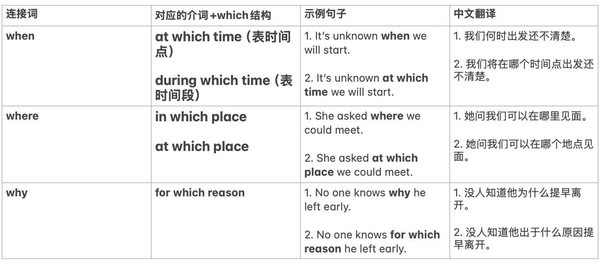
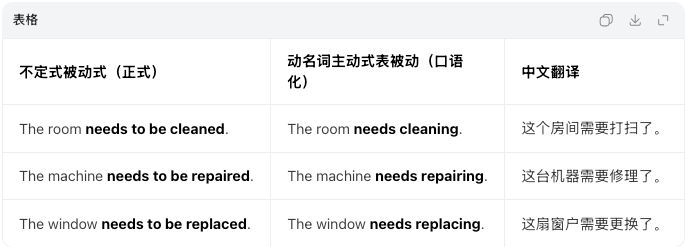
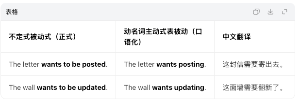
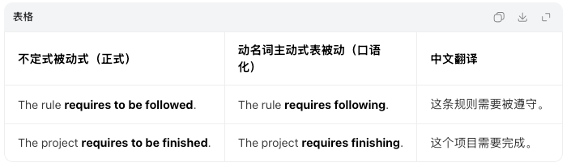
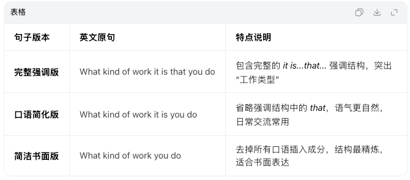

【老师说】
提取图片中的课文文本

【学生说】
英文原文
I'd like to begin by asking you to imagine that I've been asked to find some art for my company's offices.Where would I start?Well, the first stage in selecting art is normally for one of our art consultants to visit you on site to assess the location, the size of the area and the style of the building and so on.How much difference does it make where I actually put the paintings?A great deal!Art needs to be placed taking into account the function of a space.Different types of art are appropriate for different areas.Once we have an idea about what kind of work it is you do and how the space is used, then we begin to find artworks and present a selection of art for your business and building.We can do this on site or you can visit our galleries.The whole thing is a two-way collaborative process.So you already have the paintings?Yes, or we can ask an artist to create works for your specific space.In this case, the client has some input but it's important to remember when choosing workplace art that art is not your brand.If you ask the artist to emphasise your company image in some way, you'll just end up with bad art.Either way, you have an art consultant who oversees and project manages the production of any commissioned artwork and makes sure it's completed and installed on time and within budget.And that also includes fitting appropriate lighting and any other maintenance and fitting that you may have.

【学生说】
I'd like to begin by asking you to imagine that I've been asked to find some art for my company's offices.这句话中的imagine是表达什么意思？

【老师说】
在这句话里，imagine 是动词，意思是设想、想象。
说话者让对方先在脑海中构建一个“自己被要求为公司办公室挑选艺术品”的场景，是一种引导听众进入话题的表达手法，目的是让听众能更直观地跟随叙述的思路，并非指实际的想象行为，而是为了引出后续关于挑选办公艺术品的具体内容。
要不要我帮你整理几个imagine的常用搭配和例句，让你更好地掌握它的用法？

【学生说】
课文中提到了 Where would I start 这句话，这句话中为什么用 would？

【老师说】
在这句话Where would I start? 中，would 并非表示过去时态，而是用于委婉的假设与推测，属于虚拟语气的一种日常用法。
具体原因：

	表达假设情境：说话者是让听众“设想”自己要为公司找艺术品的场景，这个场景并非真实发生的当下情况，而是虚拟的假设，would 能体现这种非真实的语境。
	使语气更委婉：相比直接用 Where do I start?，用 would 让问句的语气更柔和、含蓄，符合日常交流中引导话题的表达习惯，避免问句显得生硬。
要不要我帮你整理几个would表示假设的常用例句，让你更直观理解这种用法？

【学生说】
文章中提到了叫 the first stage in selecting art 这个表达中 stage 什么意思？ stage 后面的 in 是什么用法？表达什么意思？

【老师说】

stage 的意思
在 the first stage in selecting art 中，stage 是名词，意为阶段；步骤，指挑选艺术品这个流程里的第一个环节。

in 的用法和含义
这里的 in 是介词，用于表示在某个行为/过程中，后接动名词（selecting art）构成介词短语，作 stage 的后置定语，说明这个“阶段”所属的具体过程是“挑选艺术品”。简单来说，in selecting art 就是“在挑选艺术品的（过程中）”，用来限定 the first stage 的范畴。
要不要我帮你整理几个stage表示“阶段”时的常用搭配和例句，方便你掌握？

【学生说】
是表达在挑选艺术品的第一步是。

【老师说】
是的，你的理解是准确的。the first stage in selecting art 直译就是“挑选艺术品的第一个阶段”，对应表达的就是“挑选艺术品的第一步”。
这里的 stage 和“step”在表示流程里的环节时，意思非常接近，日常使用中可以互换。
要不要我帮你区分一下stage和step在表示“步骤”时的细微差别？

【学生说】
那这句话可以变成 the first step in selecting art 吗？

【老师说】
可以的，the first stage in selecting art 可以替换成 the first step in selecting art，在这个语境里两者表达的意思基本一致。
两者都指挑选艺术品流程里的首个环节，日常交流中这样替换不会影响理解。
要不要我帮你整理一份易混淆同义名词的用法对比表？

【学生说】
那在什么情况下，stage和step可以互换使用呢？

【老师说】
当 stage 和 step 都表示某个流程、计划或行动中的一个环节时，二者通常可以互换使用。
具体场景：

	描述有明确先后顺序的工作、任务 or 项目流程，比如 the first stage/step in the design process（设计流程的第一个阶段/步骤）。
	指代解决问题、达成目标的具体环节，比如 the final stage/step of the experiment（实验的最后一个阶段/步骤）。
要不要我帮你整理一份stage和step的用法区别对照表，让你一眼分清不能互换的场景？

【学生说】
这篇课文中提到了一句叫 visit you on site，这句话的意思是现场见面吧？

【老师说】
你的理解是对的，visit you on site 的意思就是到现场拜访你，和“现场见面”的核心含义一致。
这里的 on site 是固定短语，意为“在现场；在实地”，强调是去到对方所在的办公场地，而非在其他地方（比如画廊）见面。
要不要我帮你整理几个on site的常用搭配和例句，方便你在不同语境下使用？

【学生说】
visit you on site可以换成visit you in person吗？

【老师说】
可以替换，但两者侧重点不同，替换后语义会有细微差别。

	visit you on site 强调拜访的地点是对方的现场/场地（比如公司办公室、项目所在地）。
	visit you in person 强调拜访的方式是亲自前往，和“线上沟通”形成对比，不限制具体地点。
要不要我帮你整理几个地点类和方式类短语的对比小清单？

【学生说】
Visit you on site 不一定指的是对方的场地吧？只是说是现场，有可能是我自己的场地。

【老师说】
你的理解有道理，visit you on site 里的 site 确实更侧重“具体的目标场地”，不一定就是对方的场地。
这个短语的核心是“到指定的现场”拜访你，这个 site 可以是对方公司的办公场地，也可以是合作项目的场地，甚至是你这边的场地，具体要结合上下文判断。比如课文里是为公司办公室选艺术品，这个 site 就特指客户公司的办公场地；但在其他场景中，site 也能指代你这边的场地。
要不要我帮你造几个不同场景下visit you on site的例句，更直观区分它的用法？

【学生说】
How much difference does it make where I actually put the paintings?这句话中的it指的什么？

【老师说】
这句话里的 it 是形式主语，用来指代后面的从句 where I actually put the paintings，避免句子头重脚轻。
简单来说，句子的真实主语是“把画放在哪里”这件事，it 只是一个替代形式，让句子结构更符合英文的表达习惯。
要不要我帮你整理几个形式主语it的典型例句，方便你举一反三？

【学生说】
通常情况下，it 不应该是指代的是 that 引导的从句吗？这里是 where 引导的从句。

【老师说】
形式主语 it 不仅可以指代 that 引导的从句，也能指代 where、when、how 等连接词引导的主语从句，这是完全符合语法规则的。
在这个句子里，it 指代的就是 where I actually put the paintings 这个由 where 引导的主语从句，本质和指代 that 从句的用法一致，都是为了平衡句子结构，避免主语过长。
要不要我帮你整理几个it指代不同类型主语从句的例句？

【学生说】
需要同时给出这些例句的中文翻译。

【老师说】
当然，这里整理了it指代不同类型主语从句的例句及对应的中文翻译，帮你更直观理解：

	It remains unknown where the meeting will be held.
会议将在哪里举行，目前仍不清楚。
It doesn’t matter when you hand in the report.
你什么时候交报告都没关系。
It is surprising how quickly she improved her English.
她的英语进步得如此之快，真让人惊讶。
It is a fact that the earth revolves around the sun.
地球绕着太阳转，这是一个事实。
It is uncertain whether he will attend the party.
他是否会参加派对，还不确定。
要不要我帮你把这些句子按连接词类型做个分类整理，方便你对比记忆？

【学生说】
需要

【老师说】

that 引导的主语从句

 It is a fact that the earth revolves around the sun.
地球绕着太阳转，这是一个事实。
It is clear that she has put a lot of effort into her work.
很明显，她在工作上付出了很多努力。
2. wh- 连接词（where/when/how）引导的主语从句

	It remains unknown where the meeting will be held.
会议将在哪里举行，目前仍不清楚。
It doesn’t matter when you hand in the report.
你什么时候交报告都没关系。
It is surprising how quickly she improved her English.
她的英语进步得如此之快，真让人惊讶。
3. whether 引导的主语从句

	It is uncertain whether he will attend the party.
他是否会参加派对，还不确定。
It depends on the weather whether we will go camping this weekend.
我们这周末是否去露营，取决于天气情况。
要不要我帮你总结一份形式主语it的核心用法口诀，方便你快速记忆？

【学生说】
需要

【老师说】
形式主语it核心用法口诀
it作形式主，真主往后移that/wh-句、不定式，统统都能替句子平衡不拗口，这个用法要牢记
口诀解读

	用it当形式主语时，真正的主语要放在句子后面；
	真正的主语可以是 that 从句、wh- 类连接词引导的从句，也可以是不定式短语；
	这么用的目的是避免句子“头重脚轻”，让表达更通顺。
要不要我帮你出几道形式主语it的填空练习题，检验一下你的掌握情况？

【学生说】
文章中提到 put the paintings 这句话中的 put 是什么意思？

【老师说】
在 put the paintings 这个表达里，put 是及物动词，意为放置、安放，特指把画作摆放在合适的位置上。
这个用法里的 put 常和表示地点的状语连用，比如课文里的语境就是讨论把画作放在办公室的哪个位置更合适。
要不要我帮你整理几个put表示“放置”的常用搭配？

【学生说】
这里的地点状语是什么呢？

【老师说】
在课文的原句 How much difference does it make where I actually put the paintings? 中，where I actually put the paintings 是主语从句，而从句里的地点状语就是 where。
这个 where 相当于 in/at which place，用来修饰动词 put，明确“放置画作”的具体地点。
要不要我帮你找出这篇课文里所有含地点状语的句子，方便你集中学习？

【学生说】
所以， it doesn't matter when you hand in the report. 这句话中when can be replaced as at which time or in which time 吗？

【老师说】
可以替换成 at which time，但不能用 in which time。

	when 在这里相当于 at which time，用来指代“提交报告的那个时间点”，时间是一个具体的节点，用介词 at 搭配更准确。
	in which time 通常用于指代一段持续的时间区间，和“提交报告”这个动作的时间属性不匹配，因此不适用。
替换后的句子为：It doesn’t matter at which time you hand in the report.
要不要我帮你整理一份when/where/why对应的介词+which结构对照表？

【学生说】
需要

【老师说】
表格

【学生说】
这篇课文中提到一句话叫 A great deal，这句话是什么意思呢？

【老师说】
在课文语境里，A great deal 是用来回答前面的问句 How much difference...，意思是差别很大、影响很大。
它在这里相当于一个省略句，完整表达可以理解为 A great deal of difference，用来强调画作摆放位置造成的影响程度。
要不要我帮你整理 a great deal 和 a great deal of 的用法区别？

【学生说】
A great deal和a great deal of有什么区别？

【老师说】

a great deal

 词性：副词短语
 含义：非常；大量地；程度很高地
 用法：用来修饰动词、形容词或副词，也可直接用于回答问题（如课文中）。
 例句：
 She misses her hometown a great deal.（修饰动词misses）
 The price has risen a great deal recently.（修饰副词recently）
 A: How much did you learn? B: A great deal.（直接回答）
a great deal of

 词性：形容词短语
 含义：大量的；许多的
 用法：用来修饰不可数名词，后接名词才能使用。
 例句：
 He spent a great deal of time on this project.（修饰不可数名词time）
 There is a great deal of get more information.（修饰不可数名词information）
要不要我帮你整理一份常见表示“大量”的短语用法对照表？

【学生说】
所以课文当中的 A great deal 应该不是副词短语的用法吧？

【老师说】
课文里的 A great deal 本质上还是副词短语的用法，不过属于省略形式。
它是对问句 How much difference does it make... 的简略回答，完整表达是 It makes a great deal (of difference)，这里的 a great deal 修饰动词 makes，体现“程度很大”，符合副词短语修饰动词的用法逻辑。
要不要我帮你整理几个省略形式的副词短语回答例句？

【学生说】
省略的用法，不省略的情况下也不是副词的用法呀。

【老师说】
其实不管省略与否，a great deal 的核心用法都是和副词功能相关的。
在完整句 It makes a great deal of difference 里，a great deal of 是形容词短语修饰名词 difference；但把这个句子简化成 A great deal 来回答时，它就回归了副词短语的属性，用来强调“（造成的差别）程度很大”，本质是对动词 makes 所体现的程度进行补充。
简单说，省略形式直接提取了原句里表程度的核心部分，功能上就变成了副词性的回答。
要不要我帮你拆解几个类似省略用法的短语，让你更清楚这种变化逻辑？

【学生说】
a great deal和a great deal of可以互换使用吗？

【老师说】
a great deal 和 a great deal of 不能互换使用，二者的语法功能和搭配对象完全不同。

	a great deal 是副词短语，用来修饰动词、形容词或副词，后面不能直接接名词，比如 She cares about the project a great deal。
	a great deal of 是形容词短语，后面必须接不可数名词，用来表示“大量的”，比如 a great deal of money。
要不要我帮你整理一份易错短语替换判断清单，帮你快速区分这类易混淆短语？

【学生说】
分析这句话的语言结构Art needs to be placed taking into account the function of a space.

【老师说】
这句话的语言结构可以拆解为以下三部分：

	主句：Art needs to be placed
这是一个被动语态的主谓结构，Art 是主语，needs to be placed 是谓语，意为“艺术品需要被摆放”。
伴随状语：taking into account the function of a space
这是现在分词短语作状语，用来补充说明“摆放艺术品”时需要遵循的条件；taking into account 是固定搭配，意为“考虑到”。
状语中的核心名词短语：the function of a space
作 taking into account 的宾语，意为“空间的功能”。
简单总结：整句是主谓 + 现在分词状语的结构，逻辑是“艺术品需要被摆放，（摆放时）要考虑空间的功能”。
要不要我帮你把这句话改成主动语态的版本，方便你对比两种语态的用法？

【学生说】
Art needs to be placed 这部分可以替换成 Art needs placing 吗？

【老师说】
可以替换，两者在语法上都正确，且表达的意思基本一致。

	Art needs to be placed 是不定式的被动结构，语气更正式、书面化。
	Art needs placing 是动名词的主动形式表被动含义，属于英语中的习惯用法，语气相对口语化一些。
这种用法适用于 need, want, require 这几个词，后接动名词主动式可表被动，和接不定式被动式语义相同。
要不要我帮你整理need/want/require表被动的两种用法的对比例句？

【学生说】
需要

【老师说】
need 表被动的两种用法对比例句

want 表被动的两种用法对比例句

require 表被动的两种用法对比例句

【学生说】
我可以说 take it into account that he is a lawyer. 吗

【老师说】
可以这么说，这个句子在语法上是正确的。
take it into account that… 是常用结构，其中 it 是形式宾语，真正的宾语是后面由 that 引导的从句，用来表达“考虑到……这一点”。
不过更自然的表达可以是 take into account that he is a lawyer，直接把从句作宾语，省略形式宾语 it，语感会更简洁流畅。
要不要我帮你整理几个take into account的实用句型，方便你在写作和口语里使用？

【学生说】
需要

【老师说】
take into account 实用句型

	主语 + take(s) + 名词/代词 + into accountWe should take his special situation into account.我们应该考虑到他的特殊情况。
	主语 + take(s) into account + that 从句You must take into account that the weather may change suddenly.你必须考虑到天气可能会突然变化。
	主语 + take(s) into account + wh- 从句The manager took into account how the new policy would affect employees.经理考虑了新政策会对员工产生怎样的影响。
	被动结构：sth. be taken into accountThese details should be taken into account when making the plan.制定计划时，这些细节应该被考虑进去。
【学生说】
Different types of art are appropriate for different areas. 这句话中的 area 应该不是指具体的面积，而是指抽象的领域，对吧？

【老师说】
你的判断是对的，这句话里的 area 不是指具体的“面积”，而是指具体的区域、场所，更偏向实际空间概念而非抽象领域。
结合课文语境（为公司办公室挑选摆放艺术品），这个 area 特指办公室里的不同功能空间，比如会议室、开放办公区、接待区这类具体场地。
要不要我帮你整理 area 表示不同含义时的常用搭配和例句？

【学生说】
这里的 appropriate for 可以提取出一个常用的短语叫 something is appropriate for a place，对吧？

【老师说】
是的，完全可以提炼出 something is appropriate for a place 这个常用短语，用来表达“某物适合某个场所”。
这个短语的适用场景很广，不仅限于物品和场地的匹配，还能延伸到“事物适合某个情境/人群”，比如 These rules are appropriate for this competition（这些规则适合这场比赛）。
要不要我帮你拓展几个appropriate for的不同场景例句？

【学生说】
Once we have an idea about what kind of work it is you do and how the space is used这句话中可以去掉it is吗？我感觉没有什么用处在这

【老师说】
可以去掉 it is，去掉后句子语法依然正确，语义也完全不变。
原句中 what kind of work it is you do 里的 it is 属于插入成分，作用是让句子的语气更舒缓、表达更口语化，并非语法必需的结构。去掉后句子会更简洁：Once we have an idea about what kind of work you do and how the space is used。
要不要我帮你整理几个常见口语化插入成分的用法示例？

【学生说】
Once we have an idea about what kind of work it is you do分析一下这个句子的结构

【老师说】
这个句子是状语从句，整体结构拆解如下：

	主句框架：Once we have an idea
	Once：连词，引导条件状语从句，表“一旦……”
	we：从句主语；have：从句谓语；an idea：从句宾语
	后置定语：about what kind of work it is you do
	about：介词，引出idea的具体内容，构成介词短语作定语
	介词宾语是宾语从句 what kind of work it is you do，其中it is是口语化插入成分，可省略，省略后从句变为what kind of work you do，结构更简洁
	这个宾语从句的核心逻辑是“你从事的工作类型”
简单总结：这是一个由 Once 引导的状语从句，后接介词短语作定语，修饰 an idea。
要不要我帮你把这个句子改成更简洁的书面表达版本？

【学生说】
It is 是怎么用的？在这种情况下，我不太理解，为什么它可以这样使用？

【老师说】
在 what kind of work it is you do 这个宾语从句里，it is 是口语化的插入结构，属于英语中的强调和舒缓语气的用法，没有实际的语法功能，去掉后完全不影响句子的意思和正确性。
具体来说，这个宾语从句原本的简洁结构是 what kind of work you do（你从事的什么类型的工作）。口语中为了让表达更自然、语气更缓和，会在中间插入 it is，把句子拆成 what kind of work it is + (that) you do（这里的 that 也可以省略），本质上是借助 it is…that… 强调句型的变形，弱化了强调意味，变成单纯的口语化表达。
这种插入用法很常见，比如：

	原句：I don’t know what job you want.
	口语插入版：I don’t know what job it is you want.
要不要我帮你整理几个类似的口语插入结构例句，让你更熟悉这种用法？

【学生说】
那我可以理解为，最完整的应该是， What kind of work it is that you do.

【老师说】
是的，你这个理解完全正确。
what kind of work it is that you do 就是这个宾语从句的完整强调句型形式，这里的 it is…that… 是标准的强调结构，用来突出宾语部分 what kind of work。
口语里常会省略掉 that，就变成了 what kind of work it is you do，语气会更自然随意，和你最开始看到的句子一致。
要不要我帮你把这个句子的强调版、口语版和简洁版放在一起做个对比，方便你直观区分？

【学生说】
需要

【老师说】

这三个版本语义完全一致，只是在语气和正式程度上有区别。

【学生说】
他们三个的语气的区别，说明一下。

【老师说】

	完整强调版（What kind of work it is that you do）语气带有刻意强调的意味，会突出“工作类型”这个核心信息，适合需要明确聚焦、让对方重视这个内容的场景，比如正式问询、信息核对。
	口语简化版（What kind of work it is you do）语气自然随意，是日常对话里的常用表达，去掉that后少了强调的生硬感，更像随口的打听或闲聊，不显得刻意。
	简洁书面版（What kind of work you do）语气简洁正式，没有多余的口语化成分，结构工整，适合书面材料（如邮件、报告、问卷）或严谨的表述场景。
要不要我帮你设计几个不同场景的对话示例，让你更直观感受它们的用法差异？